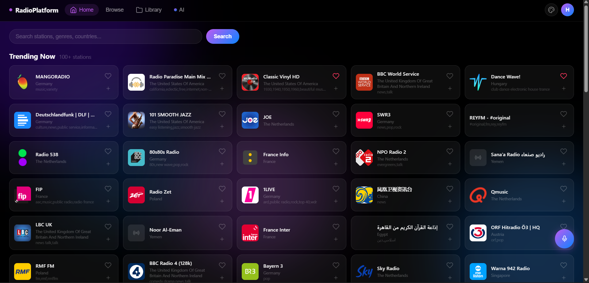
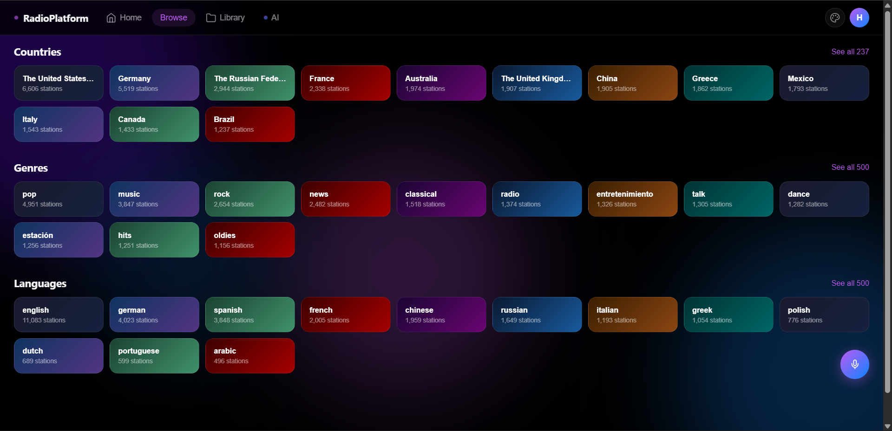
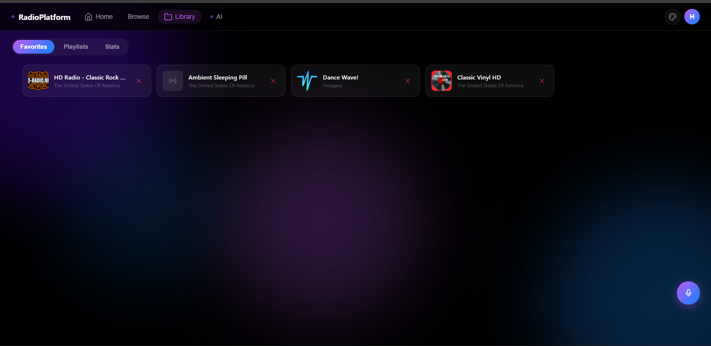
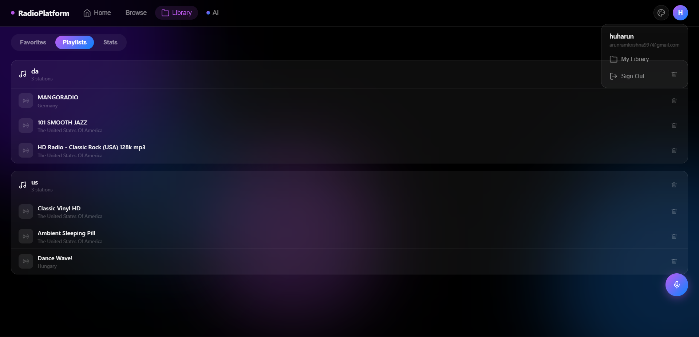
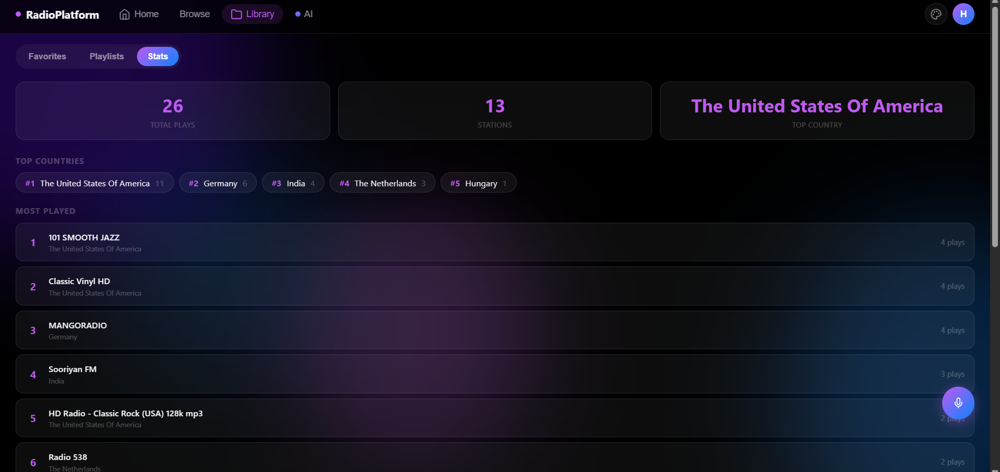
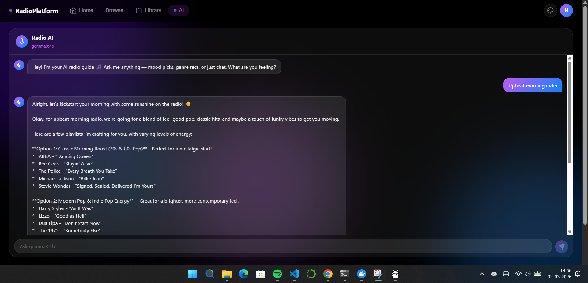

# RadioPlatform

A full-stack internet radio platform with 50,000+ live stations, user accounts, playlists, listening stats, and a local AI chat assistant.

<video src="https://github.com/user-attachments/assets/73a3f004-a8e3-49df-898f-165f9fbfdb4d" controls width="100%"></video>

---

## Screenshots








---

## Features

- 50,000+ live radio stations via [Radio Browser API](https://www.radio-browser.info/) with infinite scroll
- Search and browse by name, genre, country, or language
- Save favorites and build playlists tied to your account
- Listening stats — total plays, top stations, top countries, recently played
- AI chat assistant powered by [Ollama](https://ollama.ai) running fully locally, no API key needed
- 6 themes plus a custom color picker
- JWT-based auth with register and login
- Redis caching for fast lookups
- Fully Dockerized — one command to run everything

---

## Quick Start

You need [Docker Desktop](https://www.docker.com/products/docker-desktop/) and Git.

```bash
git clone https://github.com/huharun/radio-platform.git
cd radio-platform
cp .env.example .env
```

Edit `.env` and set a `SECRET_KEY`, then run:

```bash
docker compose up --build
```

First build takes around 2 minutes. Once it's up:

| Service  | URL                        |
|----------|----------------------------|
| Frontend | http://localhost:3000      |
| Backend  | http://localhost:8000      |
| API Docs | http://localhost:8000/docs |

---

## AI Chat

The assistant runs 100% locally — nothing is sent to any external service.

1. Download and install [Ollama](https://ollama.ai/download)
2. Pull a model: `ollama pull gemma3:4b`
3. Start Ollama, then open the AI tab in the app

The backend tries `host.docker.internal`, `172.17.0.1`, and `localhost` automatically, so it works on Windows, Mac, and Linux without any config changes.

---

## Project Structure

```
radio-platform/
├── docker-compose.yml
├── .env.example
├── backend/
│   ├── Dockerfile
│   ├── requirements.txt
│   └── app/
│       ├── main.py           # App entry, CORS, rate limiting
│       ├── config.py         # Pydantic settings
│       ├── db.py             # MongoDB + Redis connection
│       ├── routes/
│       │   ├── auth.py       # Register, login, JWT
│       │   ├── stations.py   # Search, trending, categories
│       │   ├── library.py    # Favorites, playlists, stats
│       │   └── ai.py         # Ollama proxy
│       └── services/
│           ├── auth.py       # bcrypt + JWT helpers
│           └── radio.py      # Radio Browser API + Redis cache
└── frontend/
    ├── Dockerfile
    ├── package.json
    ├── lib/
    │   ├── api.ts
    │   └── auth.ts
    └── app/
        ├── page.tsx
        ├── globals.css
        └── components/
            ├── Player.tsx
            ├── AuthModal.tsx
            ├── ThemePanel.tsx
            ├── FavoriteBtn.tsx
            ├── CategoryBrowser.tsx
            ├── LibraryPage.tsx
            ├── PlaylistModal.tsx
            ├── StatsPanel.tsx
            ├── AIChatPanel.tsx
            └── Icons.tsx
```

---

## Tech Stack

| Layer     | Tech                                                              |
|-----------|-------------------------------------------------------------------|
| Frontend  | Next.js 14, TypeScript, Zustand, CSS Variables                    |
| Backend   | FastAPI, Motor (async MongoDB), SlowAPI                           |
| Database  | MongoDB 7                                                         |
| Cache     | Redis 7                                                           |
| AI        | Ollama (local LLM, gemma3:4b recommended)                         |
| Data      | [Radio Browser API](https://www.radio-browser.info/) (free, open) |
| Container | Docker + Docker Compose                                           |

---

## API Endpoints

```
GET  /health
GET  /stations/trending
GET  /stations/search
GET  /stations/categories/countries
GET  /stations/categories/tags
GET  /stations/categories/languages

POST /auth/register
POST /auth/login
GET  /auth/me

GET  /favorites/
POST /favorites/
DEL  /favorites/{uuid}

GET  /playlists/
POST /playlists/
DEL  /playlists/{id}
POST /playlists/{id}/stations
DEL  /playlists/{id}/stations/{uuid}

POST /stats/play
GET  /stats/me

GET  /ai/health
POST /ai/chat
```

Full interactive docs at `http://localhost:8000/docs` when running locally.

---

## Dev Tips

Rebuild only the backend after Python changes:
```bash
docker compose up --build backend
```

View logs:
```bash
docker compose logs -f backend
docker compose logs -f frontend
```

Wipe everything and start fresh:
```bash
docker compose down -v
docker compose up --build
```

If you get token errors after wiping the database, clear browser storage:
```javascript
localStorage.clear()
```

---

## Credits

Station data by [Radio Browser](https://www.radio-browser.info/) — community-maintained and free.
AI runtime by [Ollama](https://ollama.ai).
